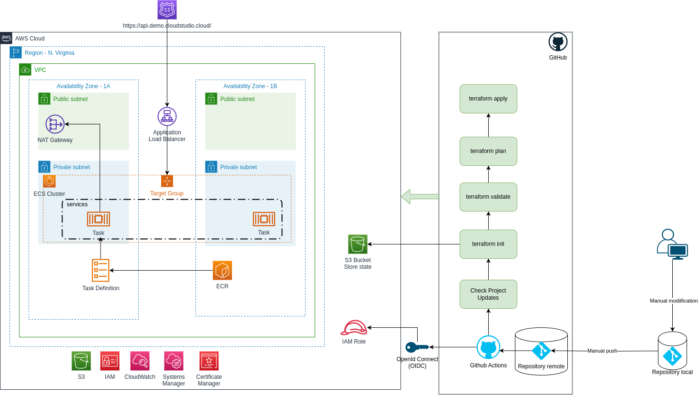

# Despliegue de Infraestructura con Terraform en AWS y GitHub Actions

## Introducción
El despliegue de infraestructura de manera eficiente y automatizada es esencial en entornos de desarrollo modernos. En este contexto, Terraform se destaca como una herramienta de infraestructura como código (IaC) que permite definir y provisionar recursos en la nube de forma declarativa. Combinado con GitHub Actions, se facilita la implementación continua (CI) y la entrega continua (CD) de aplicaciones y servicios en entornos en la nube, en este caso, enfocándonos en Amazon Web Services (AWS).

<p >
  
  <br/>
</p>


## Descripción del proyecto
la infraestructura de este proyecto está definida a través de Terraform dentro de
la carpeta "infra-as-code". En esta carpeta se encuentran los archivos de configuración.


## Cómo instalar este proyecto en su cuenta de AWS
1. Clone this repository:
```bash
git clone git@github.com:benjaminsucasairehuamani/alicorp-0000-demo-tf-ga-aws.git
```
2. Acceda a la carpeta "infra-as-code" del proyecto:
```bash
cd alicorp-0000-demo-tf-ga-aws/infra-as-code
```
3. Configurar las credenciales de AWS:
```bash
export AWS_ACCESS_KEY_ID=<your-aws-access-key-id>
export AWS_SECRET_ACCESS_KEY=<your-aws-secret-access-key>
export AWS_DEFAULT_REGION=<your-aws-region>
```
4. Configure el entorno del espacio de trabajo de Terraform (dev):
```bash
terraform workspace select $ENV || terraform workspace new $ENV
```
5. Crear un Terraform plan:
```bash
terraform plan
```
6. Aplique el proyecto terraform en su propia cuenta de AWS:
```bash
terraform apply -auto-approve
```